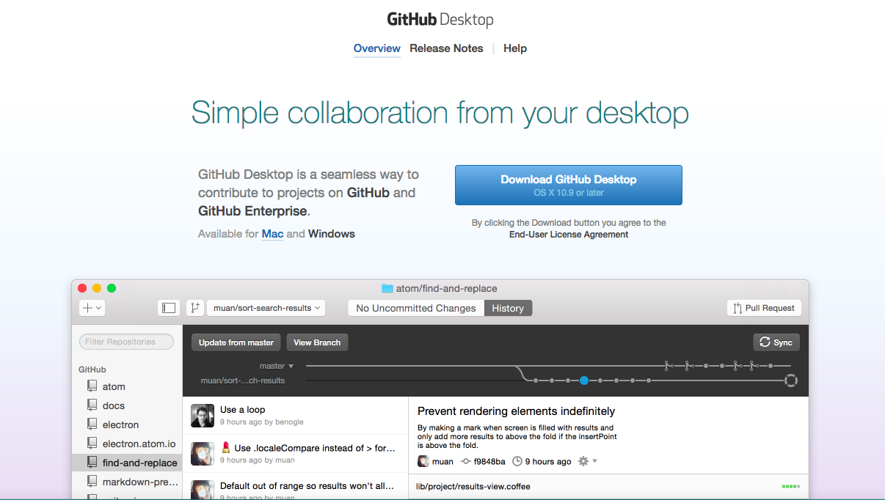
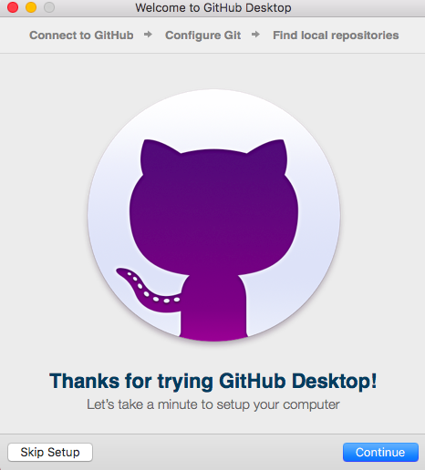
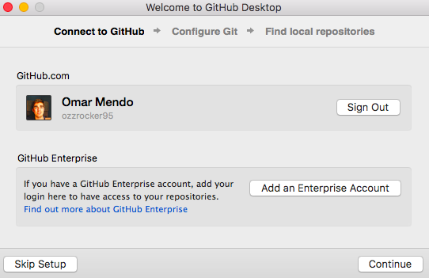
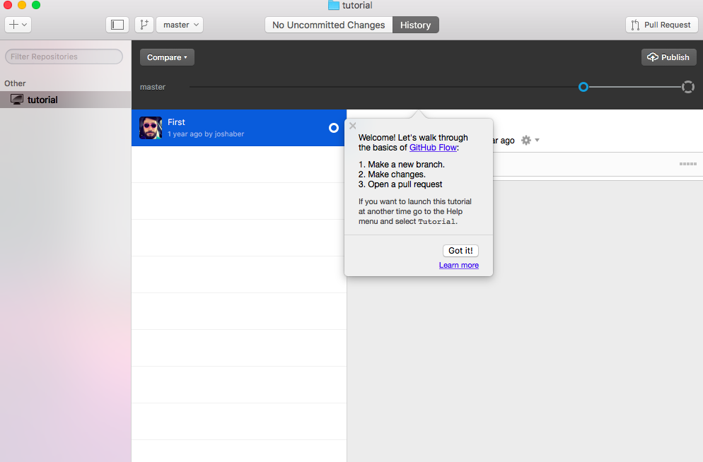

#GitHub Desktop
###Versión de escritorio de la plataforma de desarrollo más usada en la actualidad

Como dice el título, *GitHub Desktop* es una aplicación o programa de escritorio para sistemas Windows o macOs para gestionar todos tus proyectos en formato escritorio.

##Instalación de GitHub Desktop

* Para comenzar la instalación, entramos en la página oficial de *GitHub Desktop*
          <https://desktop.github.com/>
Al acceder a la página, directamente nos reconoce el sistema que el usuario está usando, y le damos a **Download GitHub Desktop**

* Tras esto, se iniciará el instalador gráfico de GitHub Desktop, por lo que es seguir las instrucciones del instalador

* Tendremos que linkear nuestra cuenta de *GitHub* para que podamos usar nuestros repositorios en la versión de escritorio.

* Tras seguir con los pasos del instalador, tendremos la interfaz lista para usar.

